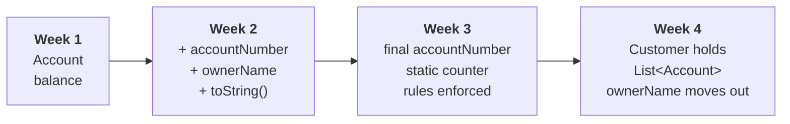

# Java OOP, lecture code

The finished code from each lecture of the Object Oriented Programming course
at University Metropolitan Tirana.

Course site: https://evisp.github.io/java-oop-course/

## How to use it

**One Eclipse project per week.** `Account.java` exists in every folder because
it changes from week to week, so they cannot share a project.

1. In Eclipse: **File**, **New**, **Java Project**. Name it `oop-week-02`.
2. Open that week's `src` folder in Explorer.
3. Drag the `.java` files onto the project's `src` folder in Eclipse.
4. Choose **Copy files** when asked.

Requires **Temurin 25**.

## Read the page first, write it yourself second

This is what the code looked like at the end of the lecture. We build it
together in class, line by line. Looking at the finished version before you
have tried it is the fastest way to feel like you understand something you
cannot yet do.

## Module 1. Objects and State

| Folder | Week | Pages |
|---|---|---|
| `week-01-why-objects` | 1 | Thinking in things, Why objects |
| `week-02-classes-and-references` | 2 | Your first class, What a variable really holds |
| `week-03-rules-and-ownership` | 3 | Objects that refuse, What belongs to whom |
| `week-04-collections` | 4 | Many objects, Objects that own other objects |

## How Account changes

Open two weeks side by side. What changed is usually the lesson.

## Not here

Seminar solutions are in a separate repository, published after each seminar.