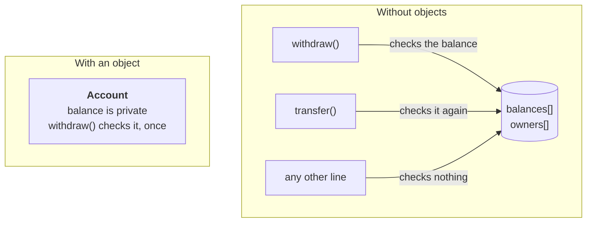

# Week 1. Why objects

[Thinking in things](https://evisp.github.io/java-oop-course/01-objects-and-state/thinking-in-things/) has no code. That is deliberate.

[Why objects](https://evisp.github.io/java-oop-course/01-objects-and-state/why-objects/) ends with the first `Account`.

## What is in this folder

| File | What it is for |
|---|---|
| `TheOldWay.java` | The version without objects. Runs, and misbehaves on purpose. |
| `Account.java` | The same bank as one class. Ten lines. |
| `BankApp.java` | Uses `Account`. All user-facing text lives here. |

Run `TheOldWay` first. The argument only lands if you have seen the problem.

## The design



Three arrows into one pile of data, and the third one is the problem. In the
second picture there is nowhere for a third arrow to go.

## Run it

Two classes have a `main`. Run them in this order.

**`TheOldWay`**

```text
=== The old way ===
  Ada Lovelace: 500.00 EUR
  Alan Turing: 1200.00 EUR
  Grace Hopper: 30.00 EUR

Withdraw 200 from account 0: true
Withdraw 900 from account 0: false
  Ada Lovelace: 300.00 EUR
  Alan Turing: 1200.00 EUR
  Grace Hopper: 30.00 EUR

Transfer 100 from account 1 to account 2: true
  Ada Lovelace: 300.00 EUR
  Alan Turing: 1100.00 EUR
  Grace Hopper: 130.00 EUR

And then somebody writes balances[1] -= 5000:
  Ada Lovelace: 300.00 EUR
  Alan Turing: -3900.00 EUR
  Grace Hopper: 130.00 EUR
```

That last balance is the whole lecture. No rule refused it, because no rule
was asked.

**`BankApp`**

```text
=== With an object ===
  Balance: 500.00 EUR

  Withdrawal of 200 accepted.
  Balance: 300.00 EUR

  Withdrawal of 900 refused. Not enough money.
  Balance: 300.00 EUR

  The balance is private, so the rule cannot be skipped.
```

## Try this

In `BankApp`, uncomment this line:

```java
ada.balance -= 5000.00;
```

It will not compile. Read the error message and write down, in your own words,
what the compiler is refusing to do. That refusal is the entire reason the
class is written this way, and it is worth seeing happen once on purpose.

## Next

Week 2 gives `Account` a number, an owner and a `toString`, and asks what a
variable actually holds.